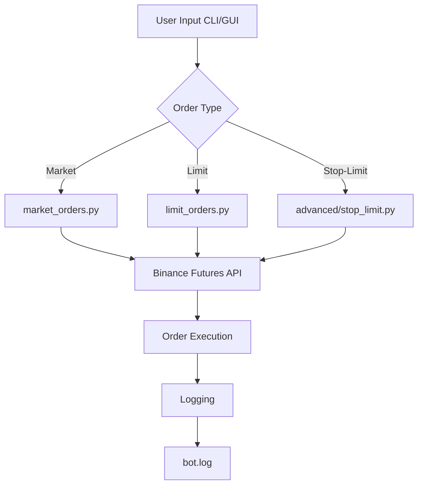

# 🚀 Binance Futures Order Bot

Welcome to the **Binance Futures Order Bot**! This project provides a set of Python scripts and a simple UI to place market, limit, and stop-limit orders on Binance Futures Testnet. Perfect for traders and developers who want to automate their trading strategies or experiment with Binance Futures API.

---

## 📁 Project Structure

```
binance_bot/
├── src/
│   ├── limit_orders.py         # Place limit orders via CLI
│   ├── market_orders.py        # Place market orders via CLI
│   ├── ui_app.py               # GUI for placing orders
│   └── advanced/
│       └── stop_limit.py       # Place stop-limit orders via CLI
├── .env                        # API credentials (not tracked)
├── .gitignore                  # Ignore .env, logs, pycache
```

---

## 📝 Features

- **Market Orders**: Instantly buy/sell at market price
- **Limit Orders**: Buy/sell at a specified price
- **Stop-Limit Orders**: Advanced order type for risk management
- **Simple UI**: Place Market/Limit orders with a user-friendly interface
- **Logging**: All actions are logged to `bot.log`

---

## ⚙️ Setup Instructions

1. **Clone the repository**
2. **Install dependencies**
   ```bash
   pip install python-binance python-dotenv
   ```
3. **Create a `.env` file** in the project root:
   ```env
   API_KEY=your_binance_api_key
   API_SECRET=your_binance_api_secret
   ```
4. **Run scripts** (see below for usage)

---

## 🖥️ CLI Usage

### Market Order
```bash
python src/market_orders.py BTCUSDT BUY 0.01
```

### Limit Order
```bash
python src/limit_orders.py BTCUSDT SELL 0.01 30000
```

### Stop-Limit Order
```bash
python src/advanced/stop_limit.py BTCUSDT BUY 0.01 29500 29400
```

---

## 🖱️ GUI Usage

Run the UI app:
```bash
python src/ui_app.py
```
- Select order type, side, symbol, quantity, and price (for limit orders)
- Click "Place Order" to submit

---

## 🗂️ File Overview

- `src/market_orders.py`: Place market orders via CLI
- `src/limit_orders.py`: Place limit orders via CLI
- `src/advanced/stop_limit.py`: Place stop-limit orders via CLI
- `src/ui_app.py`: Tkinter-based GUI for market/limit orders
- `.env`: Store your Binance API credentials (not tracked)
- `.gitignore`: Ensures sensitive files and logs are not tracked

---

## 🌐 Workflow Diagram



---

## 🛡️ Security
- **Never share your `.env` file or API keys.**
- The `.gitignore` ensures `.env` and logs are not tracked.

---

## 💡 Tips
- Use Binance Testnet for safe testing.
- Check `bot.log` for order status and errors.
- Extend the UI for more order types as needed!

---

## 📚 Resources
- [Binance API Docs](https://binance-docs.github.io/apidocs/futures/en/)
- [python-binance](https://python-binance.readthedocs.io/en/latest/)

---

## 🧑‍💻 Author
Made with ❤️ by Kriishna1
